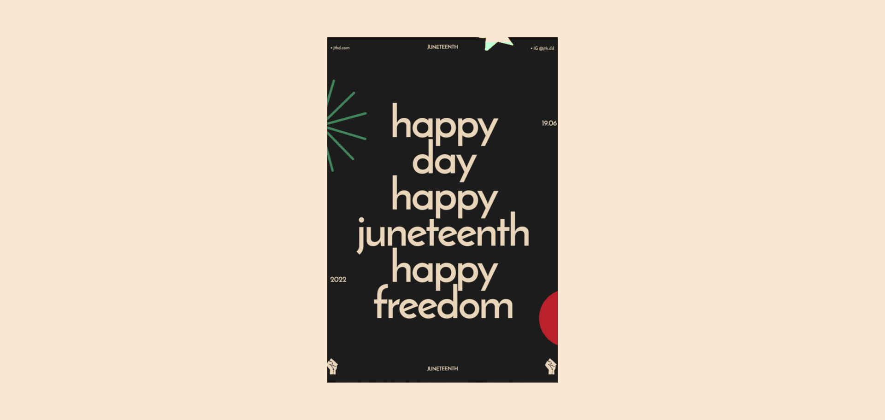

# 📘 Happy Freedom: A Tilted Book Animation for Juneteenth

## 🌐 Socials:
  

### Happy Freedom 
is an interactive web project designed to honor and celebrate Juneteenth through engaging visuals and motion. It features a stylized book that begins in a skewed position and animates upright when hovered over—symbolizing rising, freedom, and transformation. Built with modern web technologies, this animation adds depth and meaning to storytelling and UI design.

## ✨ Features: 
- 📖 Tilted Book Design: Book initially appears in a skewed/angled layout.
- 🎯 Hover Animation: Transitions smoothly to an upright position when hovered.
- 💡 Symbolic Interaction: Represents the journey from oppression to freedom.
- 🎨 CSS3-Based Animation: No JavaScript required for the core effect.
- 📱 Responsive Design: Works across all devices and screen sizes.
- ⚙️ Customizable: Easily modify angles, speed, and styling to fit your vision.

## 🖼️ Design
- Hero Section with animated book
- Banner Background Effects
- Text & Slider Animation
- Crafted in Adobe XD

#### 🧰 Built With
HTML5
CSS3
Google Fonts
Font Awesome (optional icons)
Bootstrap 5.3 (optional layout support)
Images from Freepik
Designed in Adobe XD
Content generated with ChatGPT

 
Desktop Design 

  
Desktop Design  

 

 
Desktop Design UI UX 

Design UI UX Layout 

 

Cover 

